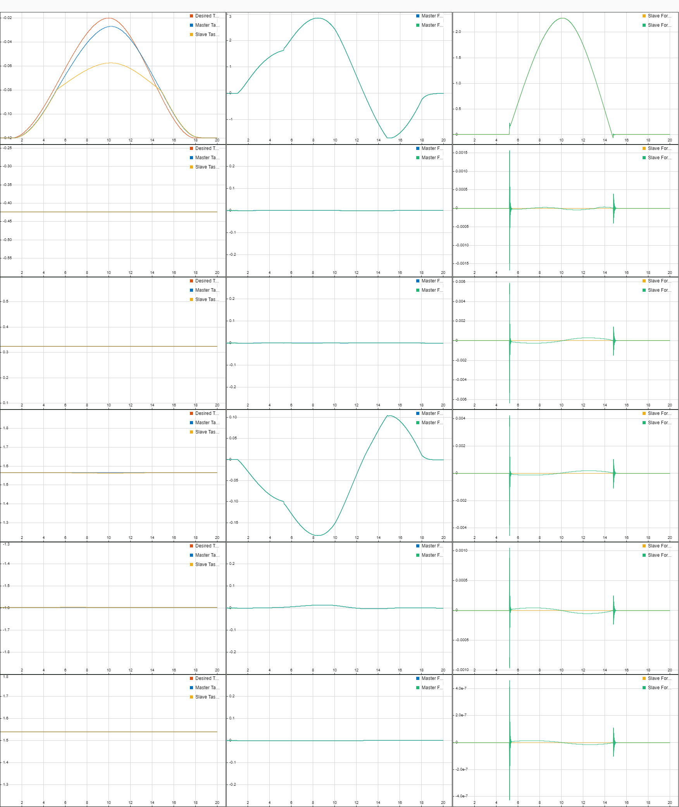

# Output Feedback Bilateral Teleoperation with Force Estimation (Paper Implementation)

Final project (paper implementation) for the Physical Human Robot Interaction course @ UNIVR.

The main goal of this project is to implement a UR5 simulation environment for the teleoperation system proposed by [Daly et al.](https://doi.org/10.1109/TCST.2013.2242329). Many of the details omitted in the brief can be found in the original [PhD thesis](http://hdl.handle.net/10012/5115).

## Notes
The 2DOF scenario has not been tested for a long time, it might not work.

## Results
In the first scenario proposed, shown below, a simple x-axis trajectory is imposed by the human operator.

The slave perfectly tracks the master trajectory but, exactly at -0.08, where the environment is positioned, it deviates, still trying to follow the trajectory, now having to deal with a spring-damper system too. Also, note how the human operator tries to increment the input force to push the slave further and reach the trajectory, but it's counter-balanced by the environment. On a side note, the x-axis orientation also shows some torque, which must be exerted by the human operator in order to deal with the mechanical structure of the UR5 robot and keep the trajectory along the x-axis straight.
